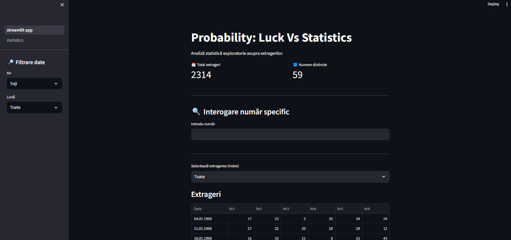
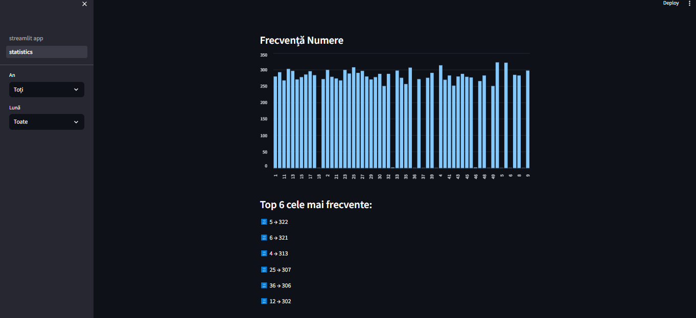

# Lottery Data Analysis (Loto 6/49)

A Python-based data analysis project that explores historical lottery draws to study statistical patterns and randomness.

The project provides a Streamlit interface for interactive analysis of 
lottery results, including frequency analysis, positional statistics, 
interval distributions, and exploratory pattern analysis.

## Features

- Load and analyze historical lottery data
- Filter draws by year and month
- Frequency analysis of numbers (1–49)
- Positional analysis of numbers in draws
- Interval distribution analysis
- Transition-based exploration between consecutive draws
- Interactive visualization with Streamlit

## Technologies

- Python 3
- Pandas
- Streamlit
- JSON for dataset storage

## Interface Preview

## Key Insights

- Lottery numbers follow a uniform distribution over time
- No strong predictive patterns were found
- Some clustering appears due to randomness, not causality
- Consecutive numbers appear in ~60% of draws
